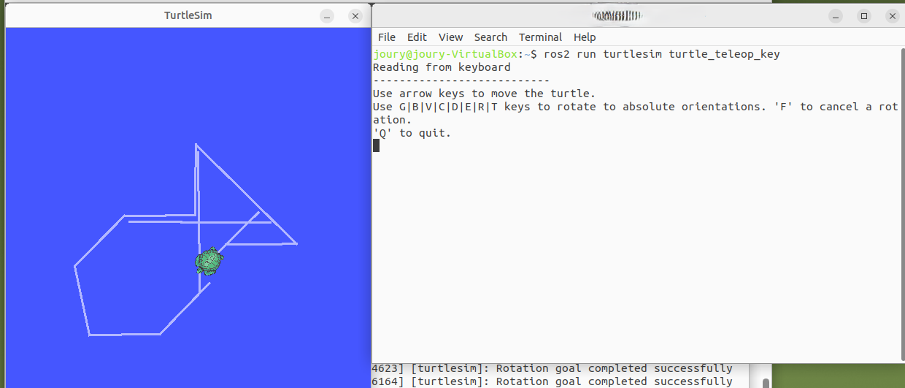
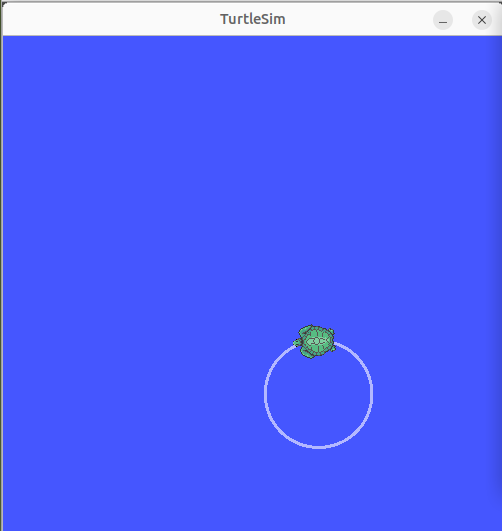

# ROS 2 Turtlesim Motion

This project demonstrates how to control the `turtlesim` package in ROS 2 using autonomous commands to move the turtle in geometric patterns such as a square or circle.

## 🐢 Description

`turtlesim` is a beginner-friendly ROS 2 package that provides a simple graphical interface to simulate a turtle robot. In this project, we automate the turtle’s motion using ROS 2 commands instead of manual keyboard input.

## 📦 Requirements

- ROS 2 (Humble/Foxy/Galactic tested)
- `turtlesim` package
- Linux or Ubuntu-based system 

##  How to Run

### 1. Launch the turtlesim node

```bash
ros2 run turtlesim turtlesim_node
```

### 2. Run the teleop key node (for manual control ):
`ros2 run turtlesim turtle_teleop_key`

output:



### 3.  Publish motion commands to move the turtle in a circular or square path

#### Example: Move in a circle:
`ros2 topic pub /turtle1/cmd_vel geometry_msgs/msg/Twist "{linear: {x: 2.0}, angular: {z: 2.0}}"
`

output:




### 4. Reset the screen:
`ros2 service call /clear std_srvs/srv/Empty
`

### 5. Spawn another turtle:
`ros2 service call /spawn turtlesim/srv/Spawn "{x: 2.0, y: 2.0, theta: 0.0, name: 'turtle2'}"
`

---

Learn more about the turtlesim package from the official ROS 2 documentation:

👉 [Introducing Turtlesim – ROS 2 Documentation](https://docs.ros.org/en/foxy/Tutorials/Beginner-CLI-Tools/Introducing-Turtlesim/Introducing-Turtlesim.html)

